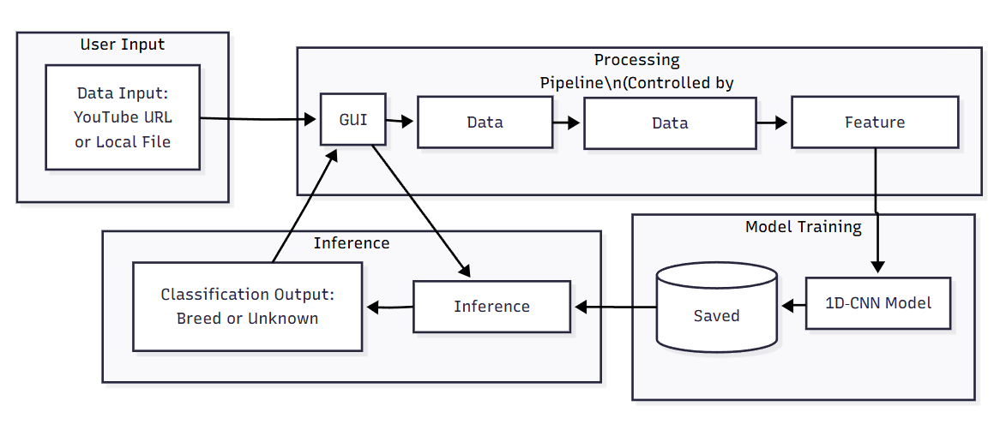

# 🐾 DogBreedAudioClassifier

**A GUI-Driven, Confidence-Aware Deep Learning Framework for Bark-Based Dog Breed Identification**

---

## 📘 Overview

This repository presents an end-to-end **audio classification system** for identifying dog breeds from bark sounds.
The framework integrates a **Graphical User Interface (GUI)** that allows non-technical users to manage datasets, train models, and perform predictions with ease.

<p align="center">
  
</p>

Built using **MFCC feature extraction** and a **1D Convolutional Neural Network (1D-CNN)**, the system not only classifies among known dog breeds but also detects **unknown or non-dog sounds** through confidence thresholding.
The design is modular, allowing users to dynamically add new breeds, retrain models, and visualize performance metrics.

---

## 🎯 Objectives

* Develop a **deep learning-based audio classification pipeline** for dog breed recognition.
* Implement a **user-friendly GUI** for data collection, training, and inference control.
* Integrate **confidence-based detection** for unknown or out-of-dataset inputs.
* Enable **dynamic retraining** and **model management** through a single interface.
* Support **dataset acquisition directly from YouTube** for flexibility in data expansion.

---

## 🧠 System Architecture

<p align="center">
  
</p>

---

## ⚙️ Features

* 🎛 **GUI-Controlled Pipeline** — One-click control for dataset handling, training, and inference.
* 🎧 **YouTube Integration** — Download bark audio and split automatically into 3-second clips.
* 🧩 **MFCC Feature Extraction** — Captures key time-frequency characteristics of each bark.
* 🧠 **1D-CNN Model** — Optimized deep neural architecture for temporal feature learning.
* 🚨 **Confidence-Aware Detection** — Labels audio as “Unknown” when below a 40% confidence threshold.
* 🔁 **Dynamic Retraining** — Add new dog breeds or additional samples without manual coding.
* 📊 **Visualization Tools** — Real-time accuracy and confidence graphing through GUI.

---

## 🧩 Model Architecture

```
Input:  (40 MFCCs × 130 timesteps)
→ Conv1D(64, ReLU) → MaxPooling1D
→ Conv1D(128, ReLU) → GlobalAveragePooling1D
→ Dense(128, ReLU) → Dropout(0.5)
→ Dense(num_classes, Softmax)
```

---

## 🧪 Experimental Setup

| Parameter            | Value                    |
| -------------------- | ------------------------ |
| Sample Rate          | 16 kHz                   |
| Clip Duration        | 3 seconds                |
| MFCC Features        | 40                       |
| Optimizer            | Adam (lr = 1e-4)         |
| Loss Function        | Categorical Crossentropy |
| Epochs               | 50                       |
| Batch Size           | 32                       |
| Confidence Threshold | 40 %                     |

---

## 📈 Results Summary

* **Classification Accuracy:** 87.3 %
* **Unknown Detection Rate (UDR):** 82 %
* GUI supports real-time prediction, model switching, and retraining.
* Training time per model (on mid-range GPU): ≈ 5 minutes for 5 classes, 500 samples/class.

---

## 🧰 Folder Structure

```
DogBreedAudioClassifier/
│
├── src/
│   ├── gui/
│   │   └── main_gui.py
│   ├── models/
│   │   ├── train_model.py
│   │   ├── train_model_cnn.py
│   ├── utils/
│   │   └── utils.py
│
├── data/
│   ├── downloads/
│   ├── dataset/
│   ├── test_clips/
│   └── predict/
│
├── results/
├── docs/
│   └── gui-demo.png
│   └── gui-demo2.png
│   └── gui-workflow.png
├── requirements.txt
├── .gitignore
└── README.md
```

---

## 💻 Installation

### Prerequisites

* Python ≥ 3.8
* FFmpeg (for audio conversion)

### Setup

```bash
git clone https://github.com/tash000/DogBreedAudioClassifier.git
cd DogBreedAudioClassifier
pip install -r requirements.txt
```

---

## 🚀 Usage

### Launch the GUI

```bash
python src/gui/main_gui.py
```

### Main Functions

| Function           | Description                                   |
| ------------------ | --------------------------------------------- |
| **Add Breed**      | Add new dataset label for training.           |
| **Download Audio** | Download bark audio directly from YouTube.    |
| **Split Audio**    | Split recordings into uniform 3-second clips. |
| **Train Model**    | Train using selected dataset and parameters.  |
| **Predict Audio**  | Classify new or unknown audio inputs.         |
| **Model Manager**  | Save or load `.h5` / `.keras` models.         |

---

## 🧾 requirements.txt

```
tensorflow>=2.9
librosa
pytube
pydub
numpy
matplotlib
pandas
scikit-learn
tk
```

---

## 🧪 References

1. K. J. Piczak, *“Environmental Sound Classification with Convolutional Neural Networks,”* IEEE MLSP, 2015.
2. M. Karaaslan *et al.*, *“Voice Analysis in Dogs with Deep Learning,”* *Sensors,* 2024.
3. S. Xu *et al.*, *“Advanced Framework for Animal Sound Classification with Features Optimization,”* *arXiv,* 2024.
4. J. Salamon and J. P. Bello, *“Deep CNNs and Data Augmentation for Environmental Sound Classification,”* *IEEE Signal Processing Letters,* 2017.
5. H. Jleed and M. Bouchard, *“CNN-Based Audio Recognition in Open-Set Domain,”* *CEUR Workshop Proc.,* 2022.

---

## 📜 License

Released under the **MIT License**.
Free to use and modify for academic and educational purposes.

---


